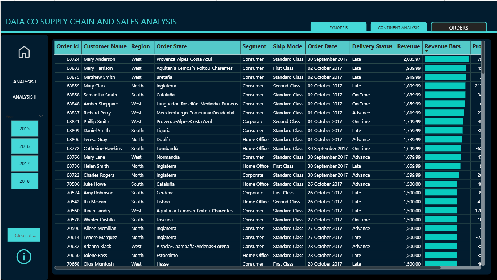
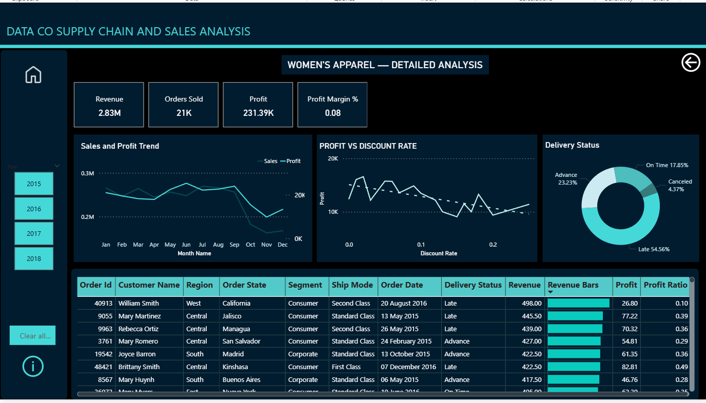

# 📦 Supply Chain & Sales Analysis

## 📌 Project Overview

This project presents an end-to-end analysis of supply chain and sales data using **Python, PostgreSQL, and Power BI**.
The project focuses on cleaning and preparing raw data, performing SQL-based analysis, and building an interactive Power BI dashboard to understand sales performance, profitability, customer behavior, regional performance, delivery trends, and the impact of discounts.

---

## 🛠️ Tech Stack

- **Python (Pandas)** – Data cleaning and preprocessing
- **PostgreSQL** – Data exploration and analysis
- **Power BI** – Data modeling and dashboard development
- **Power Query** – Data transformation
- **DAX** – KPIs and analytical measures

---

## 🔄 Project Workflow

Raw Dataset  
↓  
**Python – Data Cleaning & Preparation**  
↓  
**PostgreSQL – Data Analysis**  
↓  
**Power BI – Data Modeling & Visualization**  
↓  
**Business Insights**

---

## 🐍 Data Cleaning – Python

Python and Pandas were used to prepare the dataset before analysis.

Key tasks included:

- Checking and handling missing values
- Identifying duplicate records
- Correcting data types
- Checking numerical columns for outliers
- Removing unnecessary columns
- Cleaning and standardizing data
- Creating analysis-ready features where required
- Exporting the cleaned dataset for SQL analysis

---

## 🗄️ SQL Analysis – PostgreSQL

PostgreSQL was used to explore the cleaned dataset and answer business-related questions.

Analysis included:

- Sales and profit by region
- Product and category performance
- Top-performing products within categories
- Customer segment analysis
- Monthly and yearly sales trends
- Year-over-Year (YoY) sales analysis
- Order status analysis
- Delivery performance
- Late delivery analysis
- Discount and profitability analysis

---

## 📊 Power BI Dashboard

The cleaned and analyzed data was used to develop an interactive Power BI report.

### Dashboard Features

- Sales, Orders and Profit KPIs
- Year-over-Year performance comparison
- Monthly sales trends
- Product category analysis
- Customer segment analysis
- Regional and continent-level analysis
- Delivery performance analysis
- Profit vs Discount analysis
- Dynamic X/Y axis analysis
- Field Parameters
- Interactive slicers
- Bookmarks
- Page navigation
- Drill-through analysis
- Detailed order-level view

---

## 📈 Dashboard Pages

### 1. Synopsis
Provides an overall view of business performance including Sales, Orders, Profit, YoY performance, customer segments and product categories.


### 2. Analysis
Provides deeper analysis of sales, profit, orders, product categories and the relationship between discounts and profitability.


### 3. Continent Analysis
Analyzes business performance across different geographical regions and allows users to compare regional sales and profitability.


### 4. Orders
Provides detailed transaction-level information for deeper exploration of individual orders.


### 5. Drill-Through Details
Allows users to drill into a selected product category and analyze its sales, profit, profit margin, delivery status, discount behavior and individual orders.


---

## 💡 Key Insights

- Sales and profitability vary significantly across regions and product categories.
- High sales do not always translate into high profitability.
- Profit generally declines as discount rates increase.
- Customer segments contribute differently to overall business performance.
- Delivery performance varies across orders and regions.
- Category-level drill-through analysis helps identify the drivers behind overall performance.

---

## 🧠 Skills Demonstrated

- Data Cleaning
- Data Preprocessing
- Exploratory Data Analysis
- SQL Analysis
- Business Analysis
- Data Modeling
- DAX
- KPI Development
- Data Visualization
- Dashboard Design
- Business Intelligence

---

## 📁 Repository Structure

```text
Supply-Chain-Analysis/
│
├── data/
│   ├── DataCoSupplyChainDataset.csv
│   └── cleaned_DataCo.csv
│
├── python/
│   └── DataCo Analysis.ipynb
│
├── sql/
│   └── supply_chain_analysis.sql
│
├── powerbi/
│   └── supply_chain_dashboard.pbix
│
├── images/
│   ├── synopsis.png
│   ├── analysis.png
│   ├── continent_analysis.png
│   └── drillthrough.png
│
└── README.md
